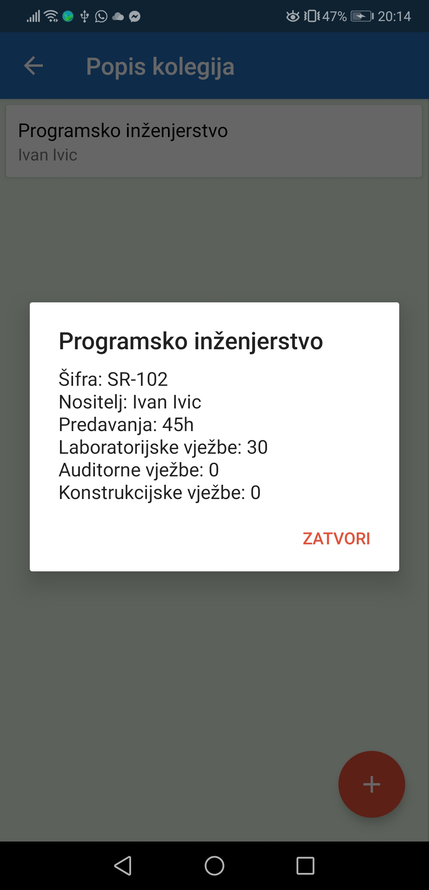

# DIGITALNI RASPORED

## AUTOR: Dominik Tkalčec

### KRATKI OPIS
Digitalni raspored je android aplikacija namjenjena za dodavanje zakazanih termina predavanja, laboratorijskih, instrukcijskih, audtornih ili konstrukcijskih vježbi te termina pismenih ili usmenih ispita za pojedine kolegije.

### SLIKE

Prijava korisnika.
 

 

Kreiranje novog fakulteta.
 

  

Pregled dodanih fakultetam mogućnost izmjene i brisanja
 

  

Početna prikaz nakon ulaska u željeni fakultet.
 

  

Klikom na "Kolegiji" vidimo popis svih dodanih kolegija. Klikom na pojedini kolegij vidimo dodatne informacije. Mogućnost izmjene i brisanja.
 

  

Klikom na "Predavanja" dodajemo predavanja za kreirane kolegije. Klikom na pojedino predavanje vidimo dodatne informacije. Mogućnost izmjene i brisanja.
 

  

Klikom na "Ispiti" dodajemo ispite za pojedine kolegije. Klikom na pojedini ispit vidimo dodatne informacije. Mogućnost izmjene i brisanja.
 

  

Klikom na "Predavanja" u donjem izborniku vidimo zakazana predavanja sortirano prema danima, tjednima i mjesecima. Klikom na pojedino predavanje vidimo dodatne informacije (lokacija, dolaznost, vrsta,...).
 

  

Klikom na "Ispiti" u donjem izborniku vidimo ispite u tijeku te prošle ispite. Klikom na pojedini ispit vidimo dodatne informacija (vrsta, lokacija, vrijeme početka,...).
 

